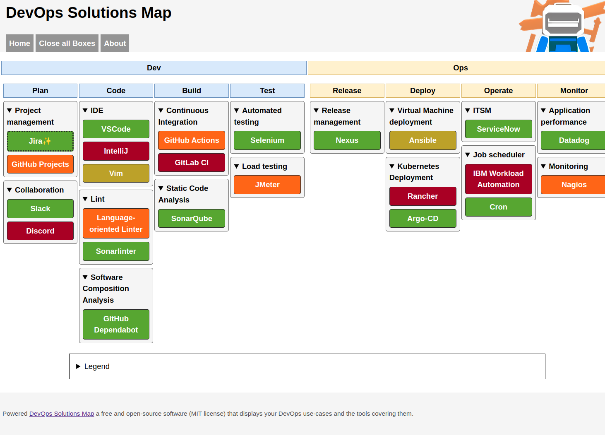

# DevOps Solutions Map

DevOps Solutions Map is a Python-based application that helps you to produce a DevOps tool chain map according to their position in the delivery loop and their use case.

This tool has been inspired by the various tech radar approach.



Instead of focusing on tools, this chart displays at first the DevOps delivery steps and the various use-cases and processes you may have for each step. For each use-case, you will find the tool covering it.

For more information about why I prefer a view displaying the use cases instead of a tools-oriented tech radar, you can read this article I've wrote on my blog [The importance of the methodology over the tools](https://blog.zedas.fr/posts/the-importance-of-the-methodology/).

## Usage

This tool can be used in two different ways. 

For both ways, the data displayed is formatted using a YAML file that will be rendered by the web application. The content is rendered using the file items order.

Please refer the [Data format](data-format.md) documentation for more details.

### Command-line arguments

By default, running the container or the `app.py` script (see below) will start the Flask server on localhost and serve the application on port 5000. Some options are available.

| Argument | Mandatory | Default | Description |
| ----------- | ----------- | --------- | ------------- |
| `-d` <br />  `--debug` | No | `False` | Enable Flask's debug mode |
| `-f` <br /> `--freeze` | No | ` False` | Run the application as a static website generator instead of serving it. See [Static site mode](#static-website-generator-mode) for mode details. |
| `--freezer-base-url` | No | `None` | Related to `--freeze`.<br>Use this option if the website is not at the root of the domain name.<br><br>Example for GitHub Pages :<br>`--freezer-base-url "https://username.github.io/my-website"` |
| `--host` | No | `127.0.0.1` | Use this option to expose the webserver outside localhost.<br><br>Note : The Container runs the application with `--host "0.0.0.0"` |
| `-p`<br>`--port` | No | `5000` | Change the listen port to the provided value.<br>By default, the container will set this option to `5000` |

### Run from sources

1. Clone the repository

```bash
https://github.com/Wivik/devops-solutions-map.git
```

2. Start a Python virtualenv

```bash
virtualenv devopsmap

source devopsmap/bin/activate
```

3. Install the requirements

```bash
pip install -r requirements.txt
```

4. Run the main app script

```bash
python app.py
```


### Run with a Container (Podman, Docker)

The application is available as a container image you may host and run in any Docker-compatible runtime.

#### Basic container with volume run

Basic run example, where `version` is the latest [available version](https://github.com/users/Wivik/packages/container/package/devops-solutions-map), using a volume bind on the host to provide the `solutions.yaml` file, exposing port 5000 :

```bash
podman run -v ./data:/data:Z -p 5000:5000 ghcr.io/wivik/devops-solutions-map:(version)

```

Note : you may also use Docker instead of Podman, of course.

Since the `/devops-map/data` path in the container is the data source, you can use any available binding to feed the content : a mounted storage, a volume, whatever. Please refer to your hosting solution documentation for the recommended architecture.

#### Container run with built-in assets

You can use your company brand logo instead of the project's by replacing the `static/img/logo.png` file in the image's content. Also the `solutions.yaml` file can be integrated in this way too.

Basic Containerfile example :

```Dockerfile
FROM ghcr.io/wivik/devops-solutions-map:(version)

COPY mylogo.png /devops-map/static/img/logo.png
COPY solutions.yaml /devops-map/data/solutions.yaml

```

Then, run the container in the same way.

### Static website generator mode

Instead of starting a web server, DevOps Solutions Map can also produce static HTML files you can host on any web hosting service.

#### Generate static website using the sources

Setup the virtualenv and the dependencies with the same method as described in [run from the sources](#run-from-sources)

Add the following arguments to the startup command.

```bash
python app.py --freeze [--freezer-base-url http://mywebsite/folder]
```

`--freeze` will produce a static website available in the `build` folder.

**Warning** : The `build` folder will be systematically erased and recreated by the `--freeze` option since Flask Freezer considers this folder its own.

If your website is not at the root of the domain name (ex : `https://mywebsite/devopsmap/`), you need to provide the argument `--freezer-base-url` with the complete website base URL.

You can test the static website by using Python's built-in webserver : 

```bash
cd build

python -m http.server 8080
```

Then, go to `http://localhost:8080` to check the result.

## Data file format

Please refer to the [dedicated documentation](data-format.md).

## Contribute

Fork the project, create a branch, open a Pull Request.

Please ensure you're using the [conventional commits](https://www.conventionalcommits.org/en/v1.0.0/) specification for changelog generation.

## License

This project is licensed under MIT.

The mascot is licensed under CreativeCommons CC-BY-SA 4.0.
