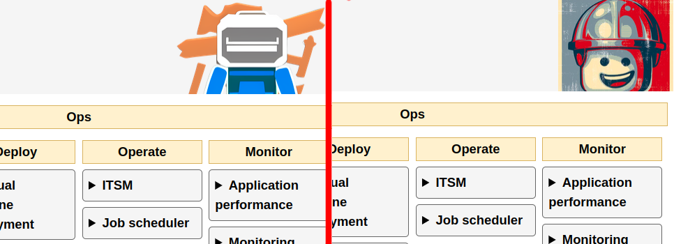
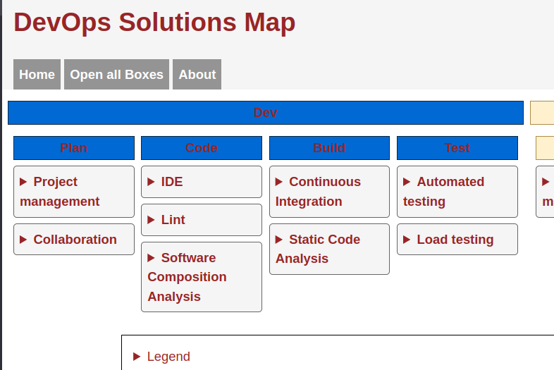

# Customize

You don't like the colors used by the application ? You want to change the logo ? It's possible to customize them.

The `data` folder can contain customized version of the `static` folder assets such as : `style.css`, `logo.png`.

The comprehensive list of customizable asset is :

- `/static/img/logo.png`
- `/static/css/style.css`
- `/static/css/custom.css`

## Customize logo

Put your image file at the following place : `/data/img/logo.png`.



The override feature does not support any other file format.

## Customize CSS

The best way is to create the following file in your `data` dir : `/data/css/custom.css`.

`custom.css` is an empty CSS file loaded after the standard CSS definition of the application. You may override inside it every classes defined in the main file.

If you just need to customize the colors, copy the `root` section in `custom.css` and adapt them.

```css
/* Warning ! This is  a terrible example */
:root {
    --sans-font: Arial, Helvetica, sans-serif;
    --mono-font: Consolas, Menlo, Monaco, "Andale Mono", "Ubuntu Mono", monospace;


    --side-dev-bg-color: #0c61d8;
    --side-dev-border-color: #112542;
    --side-ops-bg-color: #FFF2CC;
    --side-ops-border-color: #aa8f3d;
    --general-uc-bg-color: #F5F5F5;
    --general-uc-border-color: #666666;
    --usecase-tool-bg-color: #4d2323;
    --usecase-tool-border-color: #292929;
    --usecase-tool-bg-color-hover: #d62222;
    --standard-border-radius: 5px;
    --text: #922626;
    --bg: #ffffff;
    --main-menu-link-color: #fff;
    --main-menu-link-bg-color-hover: #4e4e4e;
    --main-menu-link-bg-color: #949494;

    --footer-bg-color: #F5F5F5;
    --footer-border-color: #666666;
    --footer-font-color: #4e4e4e;

    --orange: #FA6800;
    --red: #A20025;
    --grey: grey;
    --green: #60A917;
    --white: white;
    --black: black;
    --yellow: #b9a402;
}
```



*You've been warned*

The main CSS file can also be overrided if necessary. Just put a file name `style.css` in `/data/css/style.css`. But keep in mind that this file will override the whole web styling of the page. I recommend to keep using `custom.css` for minor tweakings.

